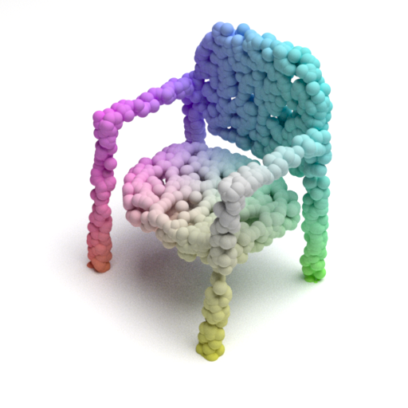

# Point Cloud Renderer

### What's new
* updated script to use mitsuba2 (ldrfilm -> hdrfilm)
* added script to convert exr to png

### Prerequisites
* python 3+
* numpy
* opencv-python
* mitsuba2

### Run
```
python pointflow_fig_colorful.py
mitsuba mitsuba_scene.xml
python exr2png.py --exr_path=mitsuba_scene
```

## Results
<p float="left">
    
</p>

### Acknowledgements
[Original Code](https://github.com/zekunhao1995/PointFlowRenderer)

### Other Modifications
[Multiple Point Cloud Renderer using Mitsuba 2](https://github.com/tolgabirdal/Mitsuba2PointCloudRenderer)

[comment]: <> (Instructions and scripts for rendering point cloud figures shown in **PointFlow: 3D Point Cloud Generation with Continuous Normalizing Flows**.)

[comment]: <> ([[Paper]]&#40;https://arxiv.org/abs/1906.12320&#41; [[Project GitHub]]&#40;https://github.com/stevenygd/PointFlow&#41;.)

[comment]: <> (The script generates a XML file, which describes a 3D scene in the format used by Mitsuba. You will then be able to render it with Mitsuba.)

[comment]: <> (## Dependencies)

[comment]: <> (* Python 3.6)

[comment]: <> (* [Mitsuba Renderer]&#40;http://www.mitsuba-renderer.org/&#41;)

[comment]: <> (## Instructions)

[comment]: <> (```bash)

[comment]: <> (# Generate scene XML file)

[comment]: <> (python3.6 pointflow_fig_colorful.py)

[comment]: <> (# Render using Mitsuba)

[comment]: <> (mitsuba mitsuba_scene.xml)

[comment]: <> (```)

[comment]: <> (## Examples)

[comment]: <> (<p float="left">)

[comment]: <> (    )

[comment]: <> (</p>)

[comment]: <> (## Cite)

[comment]: <> (Please consider citing our work if you find it useful:)

[comment]: <> (```latex)

[comment]: <> (@article{pointflow,)

[comment]: <> ( title={PointFlow: 3D Point Cloud Generation with Continuous Normalizing Flows},)

[comment]: <> ( author={Yang, Guandao and Huang, Xun, and Hao, Zekun and Liu, Ming-Yu and Belongie, Serge and Hariharan, Bharath},)

[comment]: <> ( journal={arXiv},)

[comment]: <> ( year={2019})

[comment]: <> (})

[comment]: <> (```)
